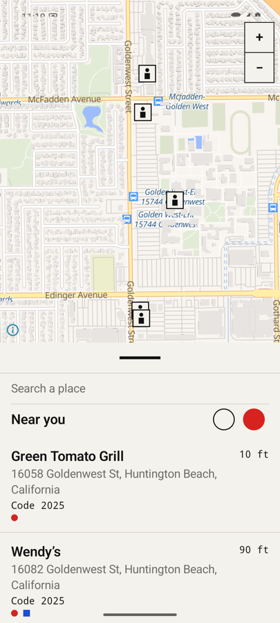
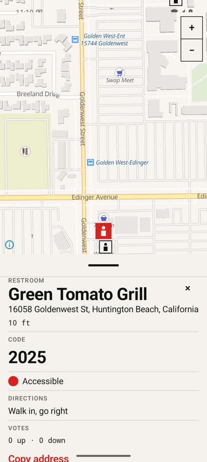
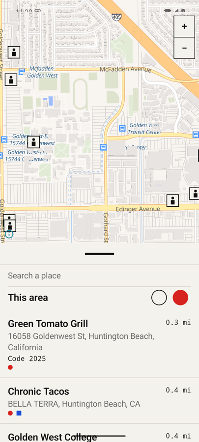
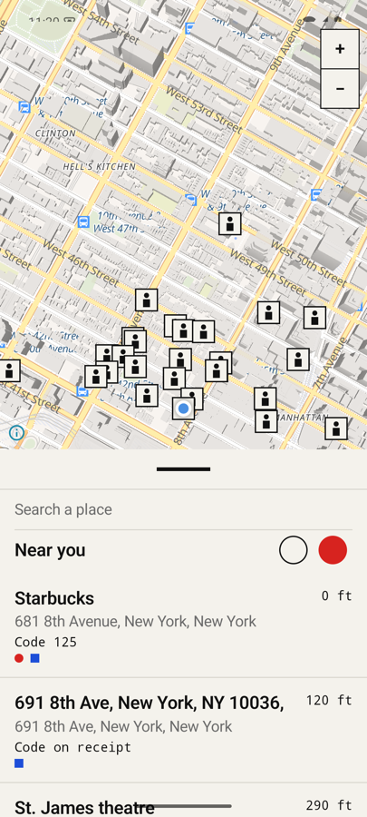

# Restroom for Android

Find the nearest public restroom — and the door code to get in.

Sibling of [restroom-ios](https://github.com/kevinpostal/restroom-ios): same data, same behaviour, same
Rams × Bauhaus look. All the logic is one C++ core shared in spirit with the Swift model; the Android
shell only fetches bytes, reads location, hosts the map and renders what the core publishes.

**Install (testers):** download the latest APK from
[Releases](https://github.com/kevinpostal/restroom-android/releases/latest) on your phone, open it, and
allow installs from your browser when Android asks. Android 8.0+, arm64. Grant location on first launch.

## What it does

| Near you | Door codes | Detail card |
|---|---|---|
|  |  |  |
| Nearest 50 restrooms from Refuge, ranked by straight-line distance. "Code 125" was mined from Refuge free text. | PottyPins door codes attached to any restroom within 75 m ("Code 2025"). | Big code, amenities, directions, notes, votes, "Copy address", and a Directions bar that hands off to your maps app. |

| Pan to search | Warm start |
|---|---|
|  |  |
| Drag the map more than ~200 m and the header flips to "This area"; rows stay on screen until the new ones land, with a "Searching…" tile and a paper wash over the map. | Relaunch and the last day's result tiles come straight off disk — no "Loading…" — while fresh pages are fetched behind them. |

- **Data:** [Refuge Restrooms](https://www.refugerestrooms.org) (restrooms, amenities, free-text notes),
  [PottyPins](https://pottypins.com) (door codes), [OpenStreetMap via Overpass](https://overpass-api.de)
  (parks and campgrounds — tagged, and never claimed as verified restrooms).
- **Map:** [MapLibre](https://maplibre.org) with the [OpenFreeMap](https://openfreemap.org) "liberty" style.
  No Google services required.
- **Door-code heuristic** (identical to iOS): mention → negation → digits → receipt → ask staff.
  `"There's a code: 125"` → *Code 125*; `"bathroom code is on the receipt"` → *Code on receipt*;
  `"you don't need a code"` → nothing.
- **Cache:** results are keyed by 0.01° grid cell (~1.1 km). A page is *fresh* for 10 minutes and
  *servable* for a day; a load unions the centre cell with its 8 neighbours and re-ranks locally, so a pan
  into cached ground is instant. The 8 neighbours are prefetched one at a time after every load. The
  newest 64 pages are persisted to `cache/tiles.json`.
- **Accessibility:** every control is labelled; rows read as "name, address, Door code 2 5 8 0, 0.2 miles,
  Accessible"; nothing smaller than 44 dp.

## Design

Dieter Rams' ten principles applied with a Bauhaus vocabulary: one paper, one ink, three primaries that
only ever mean one thing each (red circle = accessible, blue square = unisex, yellow triangle = changing
table), an 8 dp grid, a monospace face for anything you'd type on a keypad, no corner radii, no shadows,
no icons where a word will do. Dark mode swaps paper and ink and nothing else.

Tokens live in `app/src/main/kotlin/com/kevinpostal/restroom/ui/Theme.kt` and match the iOS `Theme.swift`.

## Architecture

```
app/ (Kotlin, Compose)                      core/ (C++17, no Android deps)
┌────────────────────────────┐              ┌──────────────────────────────┐
│ Net.kt      bytes only     │──Refuge──▶   │ parseRefuge / parsePottyPins │
│ Location.kt last-known +   │──Overpass─▶  │ parseOverpass                │
│             current fix    │──PottyPins─▶ │ parseAccess / accessFromPin  │
│ FinderViewModel.kt         │──store(x,y)▶ │ TileCache  fresh/servable/   │
│   reload/explore/refresh   │◀─publish()── │            ring/pool/save    │
│ ui/MapPane.kt  MapLibre    │   JSON       │ rank (haversine, top 50)     │
│ ui/FinderScreen.kt sheet   │              │ attachPins (≤ 75 m)          │
│ Core.kt   ↔  cpp/jni.cpp   │              │ toJson (+ derived text)      │
└────────────────────────────┘              └──────────────────────────────┘
```

- `core/include/restroom/core.h` is the whole contract. `Core::publishJson(lat, lon, now)` returns the
  ranked, pin-attached list with every display string (`accessTitle`, `accessSpoken`, `distanceText`,
  `addressLine`, …) already computed, so Kotlin never interprets data.
- JNI moves raw UTF-8 `ByteArray`s, not `jstring`s: modified UTF-8 would mangle emoji in Refuge comments.
- `FinderViewModel` mirrors the iOS `FinderModel` line for line, but every cache decision
  (`isFresh`, `isServable`, `ringServable`, `missingRing`) is a call into the core.
- The map only triggers a search on a real finger gesture (`REASON_API_GESTURE`); programmatic recentres
  and MapLibre's initial world-view idle never do.

## Build

Toolchain (macOS arm64, no sudo): `tools/bootstrap-mac.sh` installs JDK 17 (Homebrew formula), Android
command-line tools, SDK 35, NDK 27, CMake 3.22, the emulator and an Android 15 arm64 AVD named `restroom`.

```
make host-test              # C++ core unit tests on the Mac (GoogleTest, 30 cases)
make build                  # debug APK, core built by the NDK (arm64-v8a)
make emu                    # boot the emulator and wait for Android
make install run            # install the debug APK and launch it
make geo LAT=… LON=…        # teleport the emulator GPS — send it *after* the app is listening
make shot                   # screenshot to /tmp/android.png
make uitest                 # instrumented Compose tests on the booted emulator
./gradlew assembleRelease   # release APK, signed with ~/.android/restroom-release.jks if present
```

`JAVA_HOME` and `ANDROID_HOME` default to the bootstrap locations; override on the `make` line.

## Tests

- **Host:** `core/tests/` — door-code parsing (every live phrasing from the iOS suite), PottyPins and
  Refuge decoding with missing keys and bad shapes, Overpass nodes/ways/campgrounds, cell rounding, ring
  order, ranking, pin matching, tile-cache TTLs, pool union/dedup, disk round-trip, corrupt file, 64-entry cap.
- **Instrumented:** `app/src/androidTest/.../FinderUiTest.kt` launches `MainActivity` with the `uitest`
  intent extra, which swaps in fixture data (four Apple Park restrooms, one park, one PottyPins pin) and a
  memory-only cache: rows with code and distance, tap → detail card, refresh → loading ring and
  "Searching…" tile.

## Layout

```
core/            C++ library + GoogleTest suite (CMake, FetchContent for nlohmann_json and googletest)
app/src/main/cpp JNI shim and the CMake file Gradle drives
app/src/main/kotlin/com/kevinpostal/restroom
  Core.kt        external funs + Place data class
  Net.kt         OkHttp fetchers, PottyPins disk cache, Geocoder
  Location.kt    LocationManager flow
  FinderViewModel.kt
  Fixtures.kt    uitest seams
  ui/            Theme, Widgets, FinderScreen, MapPane, ResultList, DetailCard
tools/bootstrap-mac.sh
Makefile
```

## Credits

Restroom data © [Refuge Restrooms](https://www.refugerestrooms.org) contributors. Door codes from
[PottyPins](https://pottypins.com). Map data © [OpenStreetMap](https://www.openstreetmap.org/copyright)
contributors, tiles by [OpenFreeMap](https://openfreemap.org), rendered by [MapLibre](https://maplibre.org).
